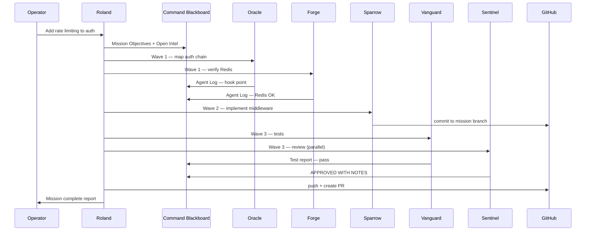

# Sample Workflow — Rate Limiting on Auth Endpoints

Realistic mission showing Roland's **Assess → Plan → Delegate → Monitor → Review → Report** loop with Halo callsigns.

## Operator Request (Web UI)

```
Add rate limiting to /login and /register — 10 requests per minute per IP.
Use existing Redis. Include tests. Open a PR when done.
```

## Phase 1 — ASSESS

Roland reads the request and Command Blackboard.

| Signal | Value |
|--------|-------|
| Complexity | multi-domain (middleware + Redis + tests + PR) |
| Route | Delegate |
| Unknowns | Redis connection config in prod vs staging |

**Blackboard update:**

```markdown
## Mission Objectives
- **M-2026-0042** [P2 active]: Rate limit auth endpoints — 10 req/min/IP via Redis

## Open Intel
- Confirm Redis connection string available in staging (Forge)
```

## Phase 2 — PLAN

Roland decomposes into waves:

| Wave | Tasks | Parallel? |
|------|-------|-----------|
| 1 | Oracle: map auth middleware chain | — |
| 1 | Forge: verify Redis config in repo/CI | ✓ parallel |
| 2 | Sparrow: implement RateLimitMiddleware + wiring | — |
| 3 | Vanguard: author + run tests | — |
| 3 | Sentinel: review diff (parallel with Vanguard run phase) | ✓ partial |
| 4 | Roland: synthesis + PR readiness report | — |

**GitHub:** Web UI creates branch `roland/add-rate-limiting-auth`.

## Phase 3 — DELEGATE (Wave 1)

### SDK spawn (interactive Cursor path)

```typescript
import { Agent } from "@cursor/sdk";
import { loadUnscAgents, toSdkAgentDefinitions } from "../dist/rco/unsc-agents.js";

const unsc = toSdkAgentDefinitions(loadUnscAgents());

await using roland = await Agent.create({
  apiKey: process.env.CURSOR_API_KEY!,
  model: { id: "grok-4.3" },
  name: "Roland",
  local: { cwd: process.cwd(), settingSources: ["project"] },
  agents: unsc,
});

const run = await roland.send(`
Mission M-2026-0042: Rate limit /login and /register — 10 req/min/IP via Redis.

Wave 1 — deploy in parallel:
1. Oracle: map auth middleware chain, identify hook point for rate limiter
2. Forge: locate Redis configuration in repo and CI; confirm staging env vars

Post findings to Command Blackboard Agent Logs. Emit BLOCKER if Redis unavailable.
`);
await run.wait();
```

### CLI spawn (web UI / batch path)

```bash
roland team "Add rate limiting to /login and /register — 10 req/min/IP via Redis. Map auth chain first, then implement, test, review."
```

Legacy agent names in the task plan map to callsigns via `legacyAgentToCallsign()`.

## Phase 4 — MONITOR

**Oracle Agent Log:**

```
[2026-06-04T14:02:00Z] Chain: AuthRouter → AuthMiddleware → JwtValidator → handler.
Hook point: after JwtValidator, before handler — src/middleware/AuthMiddleware.cs:47
```

**Forge Agent Log:**

```
[2026-06-04T14:03:00Z] Redis: StackExchange.Redis in Program.cs:112. CI sets REDIS_URL secret. Staging confirmed.
```

Roland clears Open Intel, updates Key Decisions, sets Oracle/Forge → complete, Sparrow → active.

## Phase 5 — DELEGATE (Wave 2–3)

**Sparrow** implements `RateLimitMiddleware`, registers in DI, applies to `/login` and `/register` only.

**Vanguard** adds integration tests hitting 429 after 10 requests; runs `npm test`.

**Sentinel** reviews:

```
## Sentinel — Review Report
**Verdict:** APPROVED WITH NOTES
**Findings:**
1. [medium] Consider X-RateLimit-Remaining header — backlog P3
**Security:** No hardcoded secrets. IP from X-Forwarded-For handled safely behind proxy.
```

## Phase 6 — REVIEW + REPORT

Roland verifies acceptance criteria:

- [x] 429 on excess requests (Vanguard test log)
- [x] Redis-backed (Forge confirmed)
- [x] Scope limited to /login, /register (Sentinel + diff review)
- [x] Tests pass

**Operator report:**

```
Mission M-2026-0042 complete.

Delivered: RateLimitMiddleware on auth routes, 10 req/min/IP, Redis-backed.
Branch: roland/add-rate-limiting-auth
PR: #142 — APPROVED WITH NOTES (optional rate-limit headers as follow-up)

Wave summary: 4 waves, 6 agent tasks, 0 blockers.
Follow-up (P3): Add X-RateLimit-Remaining header — recommend separate mission.
```

**Blackboard:** Mission Objectives → complete. Artifacts → PR #142. Patterns → `memory.md` Proven Patterns.

## Sequence Diagram


